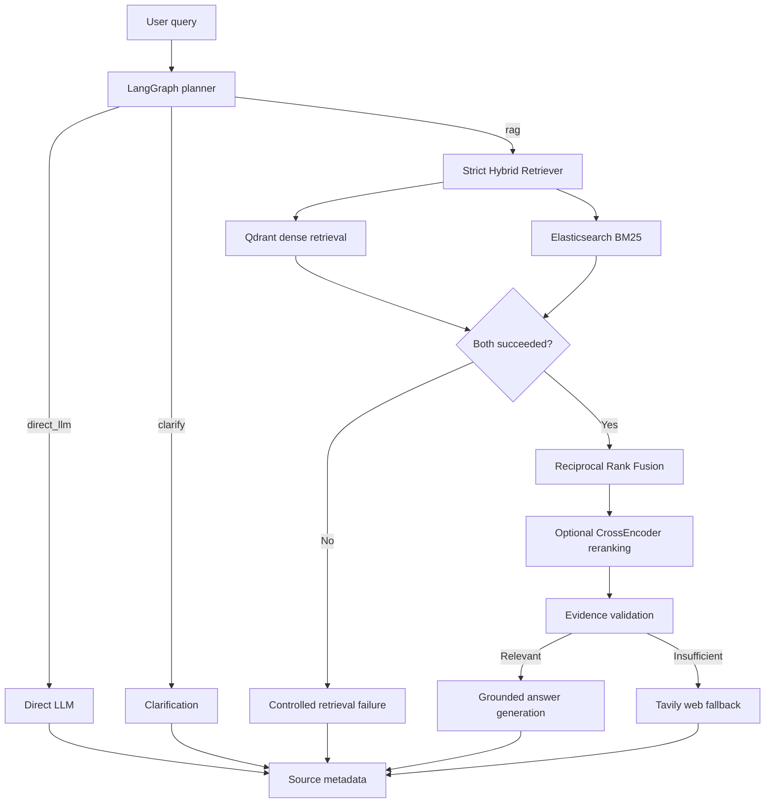

# HYBRID-RAG-EVAL

AI Research Assistant and empirical Hybrid RAG evaluation platform for an arXiv paper corpus.

The repository currently contains 107 source PDFs, 13,666 processed chunks, and a 20-question evaluation dataset. Dense vectors use `sentence-transformers/all-MiniLM-L6-v2` (384 dimensions, cosine distance) in Qdrant collection `arxiv_papers`. BM25 documents use Elasticsearch Cloud index `arxiv_papers`.

## Capabilities

- LangGraph planner with `direct_llm`, `rag`, and `clarify` decisions.
- Strict hybrid retrieval using Qdrant dense search and Elasticsearch BM25.
- Reciprocal Rank Fusion with preserved dense/BM25 provenance.
- Optional CrossEncoder reranking.
- Evidence validation, grounded generation, citations, and source badges.
- Tavily fallback only after complete hybrid retrieval succeeds but evidence validation fails.
- PDF ingestion into both cloud stores through one API call or CLI command.
- Paper listing, deletion, and reindexing.
- Optional paper-specific golden questions.
- Reproducible vector-versus-hybrid, two-model evaluation.

## Architecture



### Strict Retrieval Invariant

RRF runs only when both retrieval systems return usable results:

```text
Dense success + BM25 success  -> RRF -> optional reranking -> validation
Dense success + BM25 failure  -> stop, no RRF, no grounded answer
Dense failure + BM25 success  -> stop, no RRF, no grounded answer
Dense failure + BM25 failure  -> stop, no grounded answer
```

There is no dense-only or BM25-only fallback in `HybridRetriever`. Retrieval infrastructure failure cannot route to Tavily or an LLM answer. The existing Tavily product fallback is limited to evidence-validation failure after dense, BM25, and RRF all succeeded.

## Main Modules

```text
src/
├── agent/                 LangGraph planner, retrieval, validation, generation
├── api/                   FastAPI app, routes, and schemas
├── config/                Environment settings, clients, prompts
├── ingestion/             PDF loading, metadata, chunking, embedding, pipeline
├── retrieval/
│   ├── dense/             Qdrant retriever
│   ├── lexical/           Elasticsearch retriever
│   ├── fusion/            RRF
│   ├── reranking/         CrossEncoder
│   ├── hybrid_retriever.py
│   └── retrieval_result.py
├── services/              Application workflows
├── storage/               Cloud stores, registry, golden data
└── evaluation/            Dataset, metrics, judge, benchmark runner

scripts/                   User-facing ingestion command
test/                      Existing compatibility tests
tests/unit/                Strict retrieval and ingestion tests
tests/integration/         Paper API tests
data/evaluation/           Benchmarks, golden data, results
uploads/                   Dynamically uploaded PDFs
```

`src/retrieval/hybrid_search.py` remains as a compatibility facade. New implementation responsibilities live in the focused retrieval modules.

## Configuration

```bash
cp .env.example .env
```

Required retrieval variables:

```dotenv
QDRANT_URL=https://your-cluster.qdrant.io:6333
QDRANT_API_KEY=...
QDRANT_COLLECTION=arxiv_papers

ES_URL=https://your-elasticsearch-cloud-endpoint
ES_API_KEY=...
ES_INDEX=arxiv_papers

GROQ_API_KEY=...
TAVILY_API_KEY=...
```

Gemini is required only for evaluation:

```dotenv
GEMINI_API_KEY=...
GEMINI_MODEL=gemini-2.0-flash
```

Retrieval defaults preserve compatibility with the existing corpus:

```dotenv
EMBEDDING_MODEL=sentence-transformers/all-MiniLM-L6-v2
EMBEDDING_DIMENSION=384
DENSE_VECTOR_NAME=dense
RRF_K=60
RETRIEVAL_PREFETCH_K=50
RETRIEVAL_FINAL_K=20
RERANKER_ENABLED=false
RERANKER_MODEL=cross-encoder/ms-marco-MiniLM-L-6-v2
RERANKER_TOP_K=5
```

Secrets are read from `.env`, which is gitignored. Never place them in source files, logs, frontend analytics, or committed examples.

## Local Setup

Requirements: Python 3.12+, Node.js 18+, Qdrant Cloud access, and Elasticsearch Cloud access.

```bash
python3 -m venv .venv
source .venv/bin/activate
pip install -r requirements.txt
cd frontend && npm install && cd ..
```

Start the complete application:

```bash
./start.sh
```

Or start each process separately:

```bash
source .venv/bin/activate
uvicorn src.api.main:app --host 0.0.0.0 --port 8000 --reload
```

```bash
cd frontend
npm run dev
```

- Frontend: `http://localhost:3000`
- Backend docs: `http://localhost:8000/docs`
- Health: `http://localhost:8000/api/health`

## Docker

Docker runs the backend and frontend while using cloud retrieval services from `.env`:

```bash
docker compose up --build
```

The compose file does not create or require self-hosted Elasticsearch and does not override `ES_URL` or `QDRANT_URL`.

## Dynamic Paper Ingestion

### API

`POST /api/papers` accepts multipart form data:

- `file`: required PDF
- `metadata`: optional JSON object
- `golden_questions`: optional JSON array

```bash
curl -X POST http://localhost:8000/api/papers \
  -F 'file=@/path/to/paper.pdf;type=application/pdf' \
  -F 'metadata={"paper_id":"paper-2026","title":"Example Paper","year":2026}' \
  -F 'golden_questions=[{"question":"What is the main finding?","expected_answer":"..."}]'
```

The operation performs:

```text
validate PDF -> parse -> metadata -> chunks -> embeddings
-> Qdrant upsert -> Elasticsearch index -> completed
```

A paper is `completed` only after both stores succeed. If Elasticsearch fails after Qdrant succeeds, the pipeline attempts to remove the new Qdrant points and records the failure and rollback status.

### CLI

The CLI calls the same service and pipeline as the API:

```bash
source .venv/bin/activate
python scripts/ingest_papers.py /path/to/paper.pdf
```

Optional metadata and golden questions:

```bash
python scripts/ingest_papers.py /path/to/paper.pdf \
  --paper-id paper-2026 \
  --title "Example Paper" \
  --year 2026 \
  --golden-questions /path/to/questions.json
```

### Paper Management

| Method | Endpoint | Purpose |
|---|---|---|
| `POST` | `/api/papers` | Upload and ingest a PDF |
| `GET` | `/api/papers` | List legacy and dynamic papers |
| `GET` | `/api/papers/{paper_id}` | Read ingestion metadata |
| `DELETE` | `/api/papers/{paper_id}` | Delete from both stores |
| `POST` | `/api/papers/{paper_id}/reindex` | Re-run ingestion |

Legacy records are discovered from `data/processed/arxiv_documents.jsonl`; they are not rewritten by the refactor.

## IDs and Provenance

Existing numeric chunk IDs remain unchanged. New chunks use deterministic UUIDv5 IDs derived from `paper_id:chunk_index`. The same ID is written to Qdrant and Elasticsearch so RRF can identify matching chunks.

Fused results preserve dense rank, BM25 rank, RRF score, optional reranker score, retrieval sources, and paper/chunk metadata.

## Golden Data and Evaluation

The existing 20-question benchmark remains at:

```text
data/evaluation/evaluation_dataset.json
```

Optional uploaded-paper questions are stored at:

```text
data/evaluation/golden_dataset.json
data/evaluation/papers/{paper_id}.json
```

Run evaluation:

```bash
source .venv/bin/activate
python -m src.evaluation.runner \
  --dataset data/evaluation/evaluation_dataset.json \
  --retrieval both \
  --llm both \
  --top-k 5
```

Results are written under `data/evaluation/results/`. Metrics include Precision@K, Recall@K, MRR, correctness, faithfulness, relevance, overall score, and latency. Ground truth is never fabricated automatically.

## Testing

```bash
source .venv/bin/activate
PYTEST_DISABLE_PLUGIN_AUTOLOAD=1 python -m pytest -q test tests
```

Strict tests cover both-backend success, each single-backend failure, both-backend failure, graph termination, ingestion completion, and rollback. Cloud inspection tests require valid credentials and network access and should be run separately.

## Deployment

- `Dockerfile` starts `uvicorn src.api.main:app`.
- `render.yaml` declares Qdrant and Elasticsearch Cloud variables without values.
- The Next.js frontend continues to use `NEXT_PUBLIC_API_URL`.
- Uploaded PDFs and evaluation data require persistent volumes in production.
- Do not recreate the existing Qdrant collection or Elasticsearch index during deployment.

Established backend entry point:

```bash
uvicorn src.api.main:app --host 0.0.0.0 --port 8000
```
