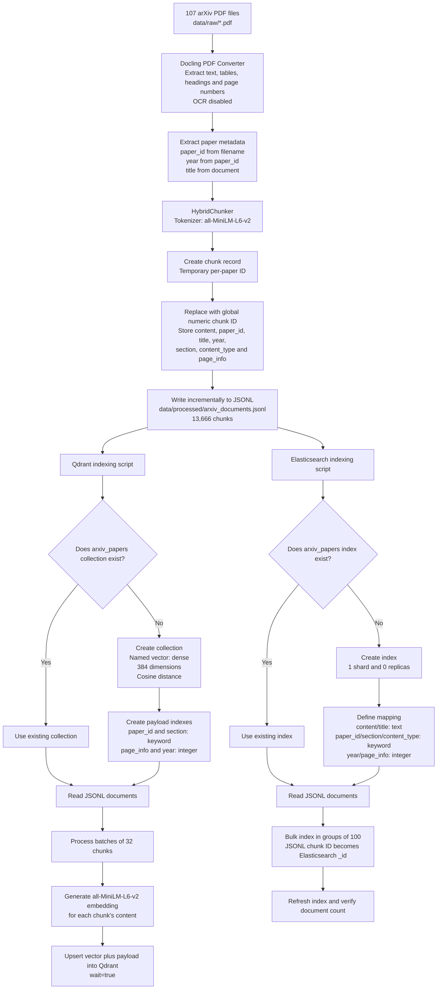

# Data Preparation and Indexing Flow

```mermaid
flowchart TD
    A["107 arXiv PDF files<br/>data/raw/*.pdf"] --> B["Docling PDF Converter<br/>Extract text, tables, headings and page numbers<br/>OCR disabled"]
    B --> C["Extract paper metadata<br/>paper_id from filename<br/>year from paper_id<br/>title from document"]
    C --> D["HybridChunker<br/>Tokenizer: all-MiniLM-L6-v2"]
    D --> E["Create chunk record<br/>Temporary per-paper ID"]
    E --> F["Replace with global numeric chunk ID<br/>Store content, paper_id, title, year,<br/>section, content_type and page_info"]
    F --> G["Write incrementally to JSONL<br/>data/processed/arxiv_documents.jsonl<br/>13,666 chunks"]

    G --> H["Qdrant indexing script"]
    H --> I{"Does arxiv_papers collection exist?"}
    I -->|No| J["Create collection<br/>Named vector: dense<br/>384 dimensions<br/>Cosine distance"]
    I -->|Yes| K["Use existing collection"]
    J --> L["Create payload indexes<br/>paper_id and section: keyword<br/>page_info and year: integer"]
    K --> M["Read JSONL documents"]
    L --> M
    M --> N["Process batches of 32 chunks"]
    N --> O["Generate all-MiniLM-L6-v2 embedding<br/>for each chunk's content"]
    O --> P["Upsert vector plus payload into Qdrant<br/>wait=true"]

    G --> Q["Elasticsearch indexing script"]
    Q --> R{"Does arxiv_papers index exist?"}
    R -->|No| S["Create index<br/>1 shard and 0 replicas"]
    R -->|Yes| T["Use existing index"]
    S --> U["Define mapping<br/>content/title: text<br/>paper_id/section/content_type: keyword<br/>year/page_info: integer"]
    T --> V["Read JSONL documents"]
    U --> V
    V --> W["Bulk index in groups of 100<br/>JSONL chunk ID becomes Elasticsearch _id"]
    W --> X["Refresh index and verify document count"]
```

Source files:

- `src/data/pdf_processor.py`
- `script/process_pdf.py`
- `script/qdrant.py`
- `script/seed_cloud.py`
- `script/elasticsearch_index.py`

