# Chat Request and Agent Workflow

```mermaid
flowchart TD
    A["User enters a question"] --> B["Next.js useChat validates non-empty input<br/>and prevents a second request while loading"]
    B --> C["Create user message and empty assistant message<br/>Reuse browser session UUID"]
    C --> D["Read API keys from browser localStorage"]
    D --> E["POST /api/chat<br/>JSON: message + session_id<br/>Header: x-groq-api-key"]

    E --> F["FastAPI validates ChatRequest<br/>message minimum length = 1"]
    F --> G["Place Groq key in request-scoped ContextVar"]
    G --> H["Get workflow from app.state<br/>Create a workflow only if startup initialization failed"]
    H --> I["Create input AgentState<br/>query, empty documents, decision fields,<br/>reasoning list, timing map and user message"]
    I --> J["LangGraph MemorySaver loads previous state<br/>session_id is used as thread_id<br/>recursion limit = 10"]
    J --> K["Optional Langfuse callback<br/>enabled when both Langfuse keys exist"]
    K --> L["Planner formats up to last 6 historical messages"]
    L --> M["Groq LLM structured output<br/>decision, route, reasoning and search_query"]

    M --> N{"Planner decision"}
    N -->|direct_answer| O["Direct generation<br/>Short friendly response, no sources"]
    N -->|reject| P["Fixed refusal response"]
    N -->|clarify| Q["Fixed clarification response"]
    N -->|process + web_search| R["Run Tavily web-search node"]
    N -->|process + vector_search| S["Run local hybrid retrieval<br/>Requested final top_k = 5"]

    S --> T{"Were documents returned?"}
    T -->|No| U["validation_result = insufficient"]
    T -->|Yes| V["Validation LLM receives original query<br/>plus first 3 documents<br/>maximum 500 characters from each"]
    V --> W{"Validation result"}
    W -->|relevant| X["RAG generation"]
    W -->|insufficient or off_topic| R
    U --> R

    R --> Y{"TAVILY_API_KEY and client available?"}
    Y -->|Yes| Z["Search resolved query<br/>Return up to 5 title/content/score/URL results"]
    Y -->|No or failure| AA["Return empty document list"]
    Z --> X
    AA --> O

    X --> AB["Format every final document<br/>title + content + paper_id/arxiv_id/URL"]
    AB --> AC["Optionally prepend last 4 historical messages"]
    AC --> AD["Groq LLM generates context-grounded answer"]
    AD --> AE["Append assistant answer to LangGraph chat history"]
    O --> AE
    P --> AE
    Q --> AE

    AE --> AF["WorkflowOutcome<br/>answer + sources + reasoning steps + node timings"]
    AF --> AG{"Answer is empty?"}
    AG -->|Yes| AH["Emergency direct LLM request<br/>then diagnostic text if still empty"]
    AG -->|No| AI["Build ChatResponse"]
    AH --> AI
    AI --> AJ["Deduplicate reasoning-step text<br/>Convert source dictionaries to Source models"]
    AJ --> AK["Return complete JSON response"]
    AK --> AL["Frontend reveals answer one character at a time<br/>3 ms delay; simulated rather than server streaming"]
    AL --> AM["Render Markdown and expandable source list"]
```

Source files:

- `frontend/hook/useChat.ts`
- `frontend/lib/api.ts`
- `src/api/route/chat.py`
- `src/agent/workflow.py`
- `src/agent/planner.py`
- `src/agent/validate.py`
- `src/agent/web_search.py`
- `src/agent/gen.py`

