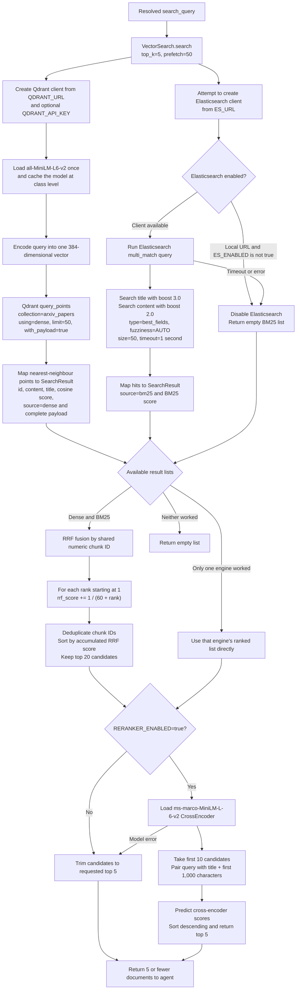

# Hybrid Retrieval Internal Flow

Current behavior notes:

- Dense and BM25 searches execute sequentially in Python.
- Qdrant performs its internal nearest-neighbour search; Python does not loop through all 13,666 vectors.
- RRF controls ordering, but its calculated score is not copied into the returned `SearchResult.score`.
- If one search engine fails, retrieval silently continues with the other engine.
- `RRF_K` exists in settings, but the active retrieval configuration currently hard-codes `60`.

Source files:

- `src/retrieval/hybrid_search.py`
- `src/retrieval/hybrid_retriever.py`
- `src/retrieval/vector_retriever.py`
- `src/config/settings.py`
- `src/config/clients.py`
