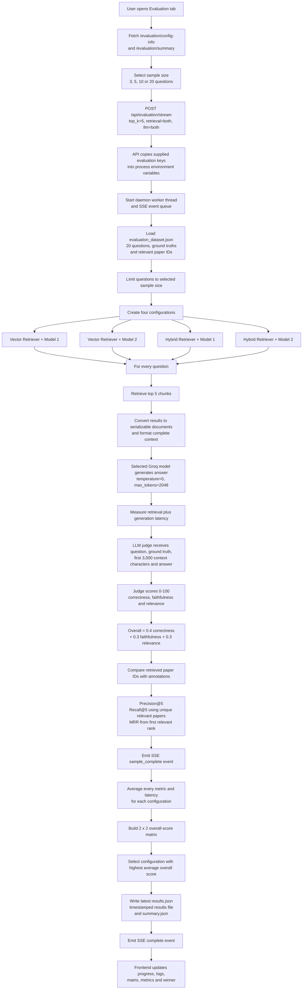

# Evaluation System Flow

Source files:

- `frontend/component/evaluation/EvaluationView.tsx`
- `src/api/route/evaluation.py`
- `src/evaluation/runner.py`
- `src/evaluation/evaluator.py`
- `src/evaluation/metrics.py`
- `src/evaluation/llm_clients.py`

