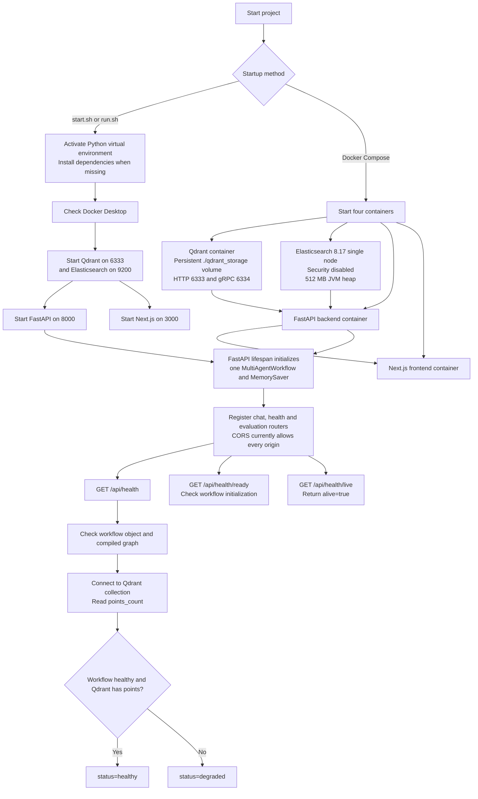

# Runtime, Deployment and Health Flow

Deployment caveats in the current code:

- Docker Compose sets `QDRANT_HOST` and `QDRANT_PORT`, but the backend reads `QDRANT_URL`.
- Docker Compose sets `ELASTICSEARCH_URL`, but the backend reads `ES_URL`.
- Local Elasticsearch is ignored unless `ES_ENABLED=true`.
- The API advertises `/api/chat/stream`, but that route is not implemented.
- The chat route supplies `node_timings`, but the backend `ChatResponse` model does not declare that field.
- The frontend Stop control stops visual playback, not an active backend request.

Source files:

- `start.sh`
- `run.sh`
- `docker-compose.yml`
- `Dockerfile`
- `render.yaml`
- `src/api/main.py`
- `src/api/route/health.py`
- `src/config/clients.py`

